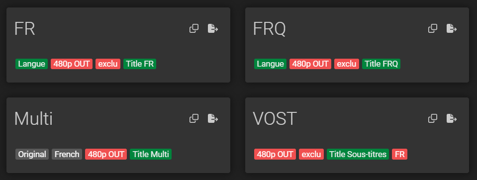
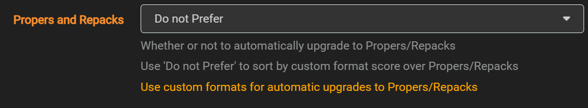
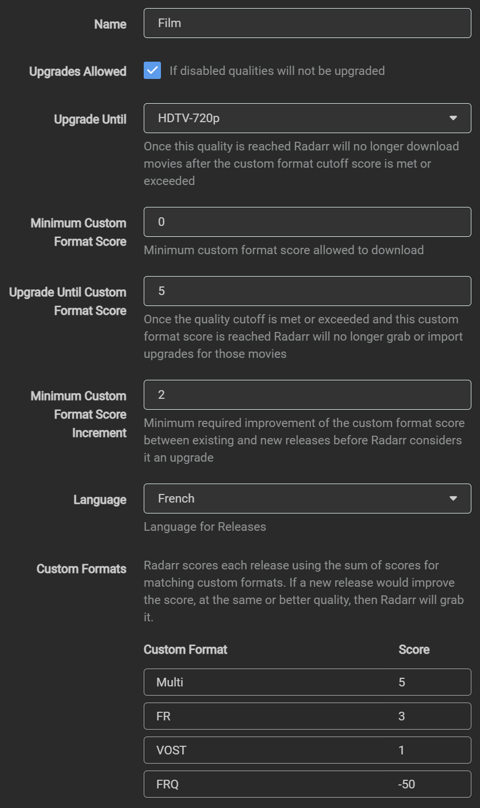

# **Optimiser cette bonne base**

Cette page arrive après l'installation de base.
Avant de toucher aux profils, vérifiez que la chaîne fonctionne déjà :

```text
demande → recherche → téléchargement → import → lecture
```

Si Radarr/Sonarr n'importent pas correctement, ou si les chemins ne sont pas propres, corrigez ça avant d'optimiser les qualités.

Si vous ne voulez pas utiliser **Profilarr**, vous pouvez appliquer les YAML ci-dessous manuellement. Sinon, vous pouvez utiliser mon repo DB FR pour Profilarr : [Profilarr-database-french-regex](https://github.com/Jojont54/Profilarr-database-french-regex)  

Adaptation des Custom-Formats de Pandaarr (sans problème d’espace, ni de transcodage)  
[https://github.com/Pandaarr/arr-custom-formats](https://github.com/Pandaarr/arr-custom-formats)

## Ce que cette page configure

Les YAML ci-dessous servent à mieux guider Radarr/Sonarr dans le choix des releases :

- préférer le MULTi quand il est disponible
- accepter le français simple si nécessaire
- éviter les versions québécoises si ce n'est pas souhaité
- accepter la VOSTFR comme solution de secours
- éviter les mauvais choix qui provoquent trop d'upgrades ou de transcodage

Pour un débutant, le plus simple est d'utiliser Profilarr avec le repo DB FR.
Les YAML restent disponibles pour ceux qui veulent comprendre ou appliquer la configuration à la main.

## Custom format (Les mêmes pour sonarr et radarr)



Il est aussi important de mettre cette option a "do not prefer" sinon le système va upgrade souvent (dans Media Management):



Pour copier les YAML, il faut aller directement dans le repo : [Optimiser cette bonne base](https://github.com/Jojont54/Guide-servarr-fr/blob/main/Docs/02-optimiser-base.md)  

### FR (On prend si y’a que ca, ou VFO)
```yaml
{
  "name": "FR",
  "includeCustomFormatWhenRenaming": false,
  "specifications": [
    {
      "name": "Langue",
      "implementation": "LanguageSpecification",
      "negate": false,
      "required": true,
      "fields": {
        "value": 2,
        "exceptLanguage": false
      }
    },
    {
      "name": "480p OUT",
      "implementation": "ResolutionSpecification",
      "negate": true,
      "required": false,
      "fields": {
        "value": 480
      }
    },
    {
      "name": "exclu",
      "implementation": "ReleaseTitleSpecification",
      "negate": true,
      "required": true,
      "fields": {
        "value": "\\bMULTI(?:[ ._-]?(?:VFI|VFF|VFQ|VF2|VFF2|VFI2|\\d))?\\b|\\b(vfq|vfi|vq)\\b|\\bFR\\s*\\+\\s*[A-Z]{2}\\b|\\b[A-Z]{2}\\s*\\+\\s*FR\\b"
      }
    },
    {
      "name": "Title FR",
      "implementation": "ReleaseTitleSpecification",
      "negate": false,
      "required": true,
      "fields": {
        "value": "\\b(vf|truefr|french|francais|français|vof|VFF|VF2|VFF2)\\b"
      }
    }
  ]
}
```

### FRQ (On en veut pas) 

```yaml
{
  "name": "FRQ",
  "includeCustomFormatWhenRenaming": false,
  "specifications": [
    {
      "name": "Langue",
      "implementation": "LanguageSpecification",
      "negate": false,
      "required": true,
      "fields": {
        "value": 2,
        "exceptLanguage": false
      }
    },
    {
      "name": "480p OUT",
      "implementation": "ResolutionSpecification",
      "negate": true,
      "required": false,
      "fields": {
        "value": 480
      }
    },
    {
      "name": "exclu",
      "implementation": "ReleaseTitleSpecification",
      "negate": true,
      "required": true,
      "fields": {
        "value": "\\bMULTI(?:[ ._-]?(?:VFI|VFF|VFQ|VF2|VFF2|VFI2|\\d))?\\b|\\b(vf|vff|truefr|french|vof)\\b|\\bFR\\s*\\+\\s*[A-Z]{2}\\b|\\b[A-Z]{2}\\s*\\+\\s*FR\\b"
      }
    },
    {
      "name": "Title FRQ",
      "implementation": "ReleaseTitleSpecification",
      "negate": false,
      "required": true,
      "fields": {
        "value": "\\b(vfq|vfi|vq)\\b"
      }
    }
  ]
}
```

### Multi (C’est ce qu’on préfère)

```yaml
{
  "name": "Multi",
  "includeCustomFormatWhenRenaming": false,
  "specifications": [
    {
      "name": "Original",
      "implementation": "LanguageSpecification",
      "negate": false,
      "required": false,
      "fields": {
        "value": -2,
        "exceptLanguage": false
      }
    },
    {
      "name": "French",
      "implementation": "LanguageSpecification",
      "negate": false,
      "required": false,
      "fields": {
        "value": 2,
        "exceptLanguage": false
      }
    },
    {
      "name": "480p OUT",
      "implementation": "ResolutionSpecification",
      "negate": true,
      "required": false,
      "fields": {
        "value": 480
      }
    },
    {
      "name": "Title Multi",
      "implementation": "ReleaseTitleSpecification",
      "negate": false,
      "required": true,
      "fields": {
        "value": "(?i)\\bMULTI(?:[ ._-]?(?:VFI|VFF|VFQ|VF2|VFQ2|VFF2|VFI2|\\d))?\\b(?![ ._-]?subs?)|\\bFR\\s*\\+\\s*[A-Z]{2}\\b|\\b[A-Z]{2}\\s*\\+\\s*FR\\b"
      }
    }
  ]
}
```

### VOSTFR (On prend si y’a que ca)

```yaml
{
  "name": "VOST",
  "includeCustomFormatWhenRenaming": false,
  "specifications": [
    {
      "name": "480p OUT",
      "implementation": "ResolutionSpecification",
      "negate": true,
      "required": false,
      "fields": {
        "value": 480
      }
    },
    {
      "name": "exclu",
      "implementation": "ReleaseTitleSpecification",
      "negate": true,
      "required": true,
      "fields": {
        "value": "\\bMULTI(?:[ ._-]?(?:VFI|VFF|VFQ|VF2|VFF2|VFI2|\\d))?\\b|\\b(vf|vff|vfq|vfi|truefr|french|vof)\\b|\\bFR\\s*\\+\\s*[A-Z]{2}\\b|\\b[A-Z]{2}\\s*\\+\\s*FR\\b"
      }
    },
    {
      "name": "Title Sous-titres",
      "implementation": "ReleaseTitleSpecification",
      "negate": false,
      "required": true,
      "fields": {
        "value": "\\b(vost|vostfr|subfr|subfrench)\\b"
      }
    },
    {
      "name": "FR",
      "implementation": "LanguageSpecification",
      "negate": true,
      "required": false,
      "fields": {
        "value": 2,
        "exceptLanguage": false
      }
    }
  ]
}}
```
## Profiles  



La suite du nettoyage automatique est dans [Optimiser les nouvelles applications](04-optimiser-applications.md).

