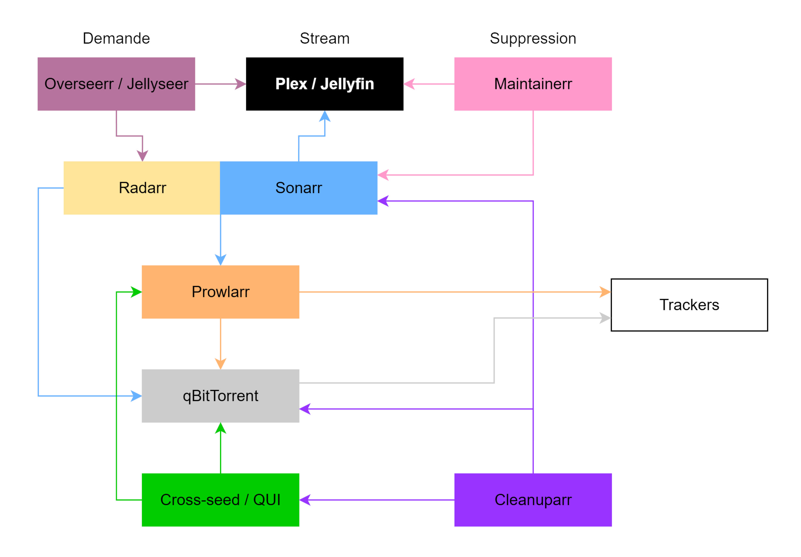

# **LES APPS : A quoi elles servent**

**Overseerr / Jellyseerr (bientôt remplacé par Seerr)**  
Application utilisateur permettant de récolter les demandes d’ajout de films et de séries sur le serveur, avec validation, suivi de statut et intégration à Radarr et Sonarr.  
**Plex / Jellyfin**  
Serveur multimédia qui indexe les contenus téléchargés et permet leur lecture en streaming sur tous les appareils (TV, mobile, navigateur, etc.).  
**Radarr**  
Gestionnaire de films qui surveille les films demandés, interroge les indexeurs via Prowlarr, envoie les téléchargements à qBittorrent, puis organise automatiquement les fichiers une fois téléchargés. Utilise des Hardlinks pour que les fichiers soit lisible par Plex / Jellyfin  
**Sonarr**  
Gestionnaire de séries TV qui suit les épisodes et saisons, recherche automatiquement les nouvelles sorties, déclenche les téléchargements via Prowlarr et qBittorrent, puis classe les fichiers pour Plex/Jellyfin. (Identique a Radarr pour les séries TV)  
**Prowlarr**  
Moteur central d’indexeurs qui communique avec les trackers (publics ou privés) et fournit à Radarr, Sonarr et autres applications une source unifiée pour rechercher des torrents ou NZB.  
**qBittorrent**  
Client BitTorrent qui télécharge réellement les fichiers à partir des torrents fournis par Prowlarr et gère le seeding une fois le téléchargement terminé.  
**Maintainerr**  
Outil de gestion et de purge de la médiathèque qui analyse Plex/Jellyfin (contenus non vus, peu populaires, trop anciens, etc.) et peut demander à Sonarr/Radarr de supprimer certains médias.  
**Cleanupparr**  
Outil d’automatisation du nettoyage côté téléchargement qui supprime ou gère les torrents et fichiers devenus inutiles (seed trop long, échecs, doublons, orphelins) dans qBittorrent. Vérifie que les hardlinks existe dans la bibliothèque.  
**Cross-seed / QUI**  
Outils d’optimisation du seeding qui détectent des correspondances entre torrents (même contenu, hashes compatibles) pour ajouter automatiquement des torrents supplémentaires et maximiser le ratio sans re-télécharger sur d'autres tracker que celui d'origine (pas accepté par tout les trackers)

Autre outils intéressant à ajouter à la config :  

\- **Maintainerr-overlay-helperr** \--\> pour les utilisateurs de Plex ajoute une catégorie "part bientôt" et ajoute un compteur à l'affiche  
\- **Tautulli** \--\> pour les utilisateurs de Plex, un dashboard  
\- **Homarr** \--\> dashboard pour les utilisateurs du serveurs  
\- **Wizarr** \--\> pour les utilisateurs de Plex, simplifie les invitations

